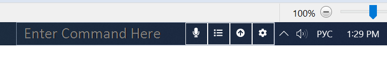
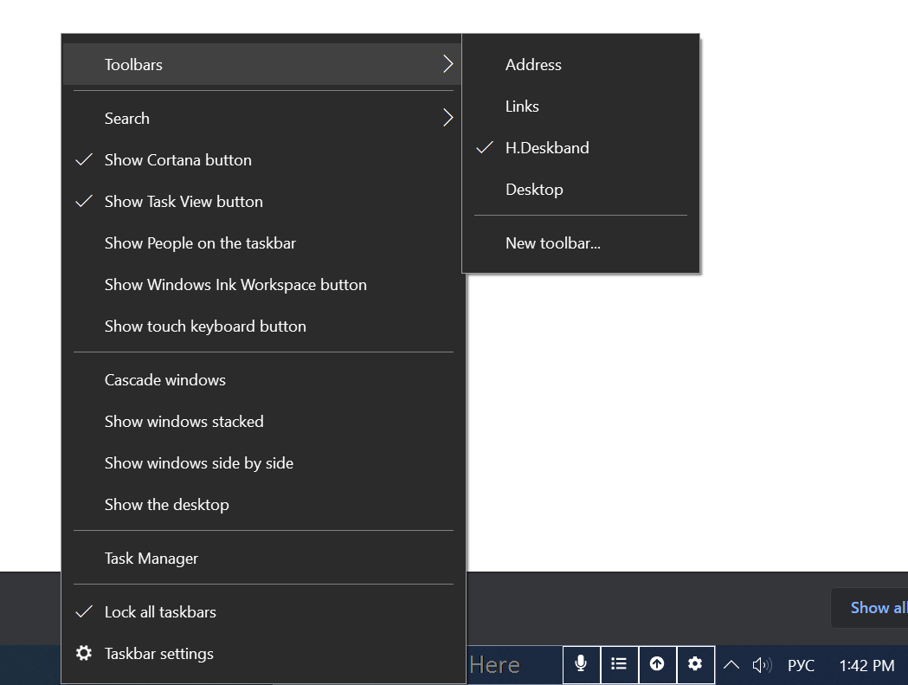

# [H.Deskband](https://github.com/HavenDV/H.Deskband/) 

 
 

Allows you to send commands to the main application. It also starts recognition when the button is pressed.

### Usage

1. Run VS as administrator
2. Start building the H.Deskband project. This will automatically register the library in the system.
3. Activate Deskband(note: It may appear on the list from the second or third try, just open this menu a few times)

### Debug
You can debug this using the H.DeskBand.TestApp project. This is a WinForms single-window application that contains this control.

### Contacts
* [mail](mailto:havendv@gmail.com)
